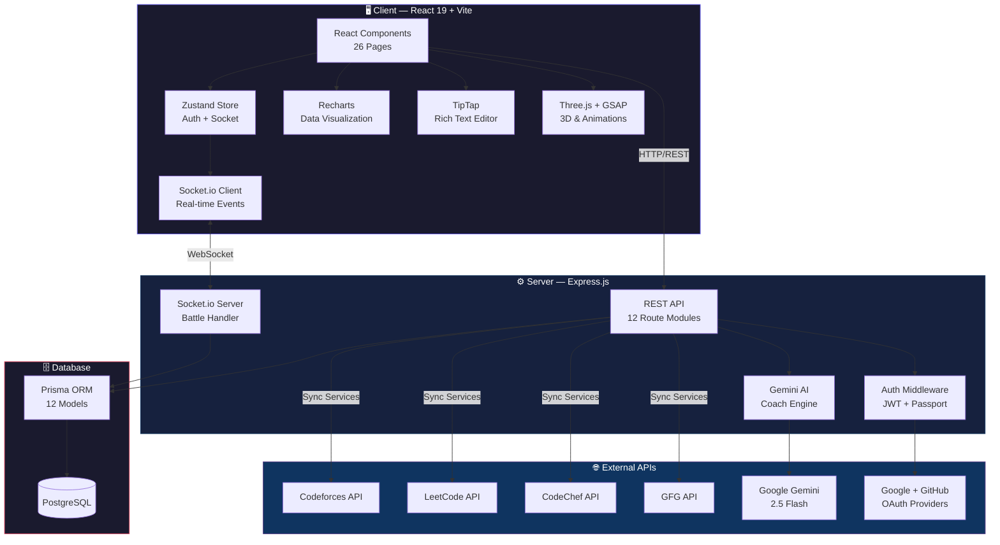
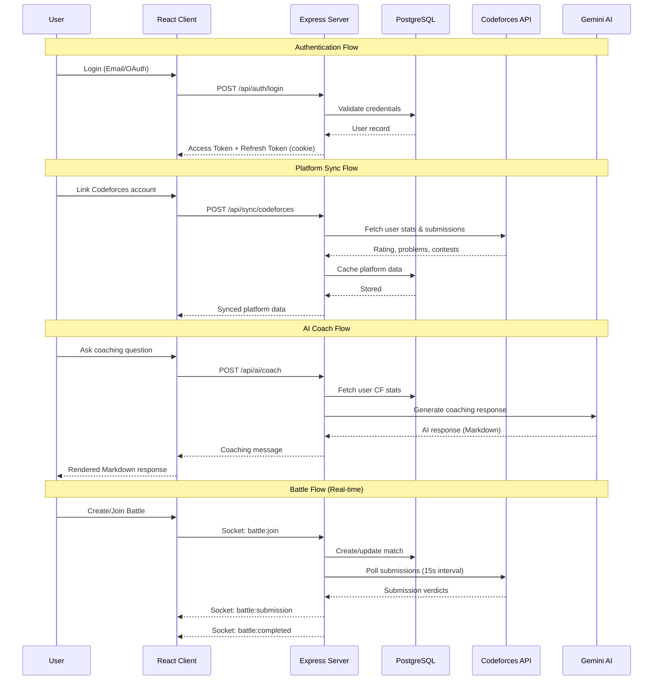
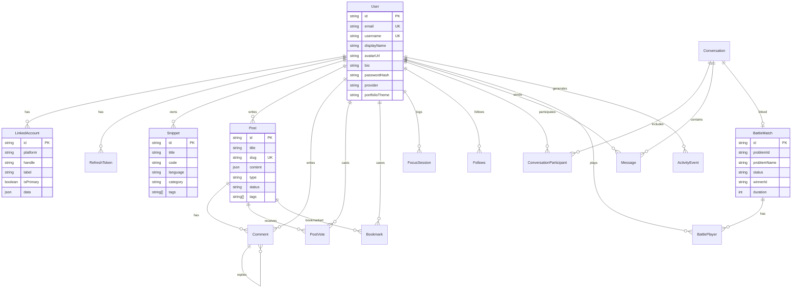

<h1 align="center">Codefolio</h1>

<p align="center">
  <strong>Your Competitive Programming Command Center</strong><br/>
  Track · Compete · Grow
</p>

<p align="center">
  
  
  
  
  
  
  
  
</p>

<p align="center">
  <a href="#-features">Features</a> •
  <a href="#-architecture">Architecture</a> •
  <a href="#-screenshots">Screenshots</a> •
  <a href="#-tech-stack">Tech Stack</a> •
  <a href="#-getting-started">Getting Started</a> •
  <a href="#-project-structure">Project Structure</a>
</p>

---

##  About

**Codefolio** is a full-stack, all-in-one ecosystem for competitive programmers. It aggregates your profiles from **Codeforces**, **LeetCode**, **CodeChef**, and **GeeksforGeeks** into a unified dashboard, provides AI-powered coaching, real-time 1v1 code battles, smart analytics with weakness detection, a rich blogging platform, and a shareable portfolio — all wrapped in a premium dark-themed UI.

---

##  Features

### Unified Dashboard
Aggregate stats from all four competitive programming platforms in one place. View combined ratings, total problems solved, contest participation, and embeddable profile badges.

### AI Coach (Gemini 2.5 Flash)
Context-aware AI coaching powered by Google's Gemini 2.5 Flash. The coach ingests your Codeforces stats (rating, solved problems, weak categories) and provides personalized training advice, algorithm explanations, and practice routines.

###  Real-Time Code Battle Arena
Challenge other users to 1v1 competitive programming duels. Socket.io-powered real-time rooms with:
- Random Codeforces problem selection by difficulty
- Live submission polling via Codeforces API
- Real-time verdict updates and winner declaration
- Integrated battle chat with spectator mode
- Countdown timer with auto-timeout

### Smart Analytics & Blind-Spot Detector
Radar chart visualization of your topic proficiency across macro-categories (DP, Graphs, Math, Greedy, etc.). Identifies your weakest areas and generates a personalized **Training Bootcamp** with curated problems.

###  Blog Engine
Full-featured blogging platform with:
- TipTap-powered rich text editor with code block syntax highlighting
- Post types: Article, Editorial, Discussion, Interview Experience
- Upvote/downvote system, bookmarks, and threaded comments
- Draft management and publishing workflow
- Search and filter by type/tags

###  Portfolio Engine
Shareable, publicly accessible developer portfolio at `/portfolio/:username` featuring:
- GSAP + ScrollTrigger cinematic animations
- Customizable themes (Dark / Light / Neon)
- Auto-populated platform stats and blog posts
- Configurable sections via settings

###  Snippet Vault
Personal algorithm template library with:
- Multi-language support (C++, Python, Java, etc.)
- Category tagging (Segment Tree, DSU, Dijkstra, etc.)
- One-click copy to clipboard
- Search and filter by language/category

### Contest Calendar
Aggregated upcoming contests from Codeforces, LeetCode, CodeChef, and AtCoder with browser notification reminders.

###  Profile & Heatmap
Comprehensive public profile (`/u/:username`) with:
- Unified activity heatmap across all platforms
- Platform-wise rating and stats breakdown
- Follow/unfollow system
- Editable bio and display name
- Embeddable profile badges (Markdown/HTML)

###  Real-Time Chat
Socket.io-powered messaging system with:
- Global channels (e.g., `#general`)
- Private 1:1 conversations
- Battle room integrated chat
- Floating chat panel accessible from any page

### Community Feed
Activity feed showing events from users you follow — account linking, rating changes, milestones, and more.

###  Authentication
- Email/password with bcrypt hashing
- Google OAuth 2.0
- GitHub OAuth
- JWT access/refresh token rotation with HTTP-only cookies
- Complete Profile flow for OAuth users

###  Multi-Account Linking
Link multiple accounts per platform (e.g., main + practice Codeforces accounts). Set primary accounts, custom labels, and sync data on-demand.

---

##  Architecture

### High-Level System Architecture



### Data Flow Architecture



### Database Schema (ERD)



---

##  Screenshots

### Landing Page
> The entry point with hero section, feature highlights, and call-to-action.


---

### Dashboard
> Unified overview of all linked platform stats, rating charts, and problem breakdowns.


---

### Codeforces Stats
> Detailed Codeforces profile with rating graph, contest history, and problem statistics.


---

### LeetCode Stats
> LeetCode profile with problem difficulty breakdown, streak tracking, and acceptance rates.


---

### CodeChef Stats
> CodeChef profile with division info, rating history, and star rating.


---

### GeeksforGeeks Stats
> GFG profile with coding score, problem breakdown by difficulty, and institution rank.


---

### AI Coach
> Gemini-powered AI coach that gives personalized competitive programming advice based on your stats.


---

### Smart Analytics
> Radar chart blind-spot detection and auto-generated training bootcamp with curated problems.


---

### Code Battle Arena — Lobby
> Create or join 1v1 battles, select difficulty range and Codeforces handle.


---

### Code Battle Arena — Battle Room
> Real-time battle with live timer, submission tracking, verdict updates, and integrated chat.


---

### Blog — Feed
> Browse community articles, editorials, discussion posts, and interview experiences.


---

### Blog — Editor
> TipTap-powered rich text editor with code blocks, images, and multi-type post creation.


---

### Blog — Post View
> Full post view with upvotes, bookmarks, and threaded comment system.


---

### Portfolio Engine
> Shareable public portfolio with GSAP cinematic animations and platform stats.


---

### Profile
> Public profile with unified heatmap, platform breakdown, follower system, and embeddable badges.


---

### Snippet Vault
> Personal algorithm template library with multi-language support and one-click copy.


---

### Contest Calendar
> Aggregated upcoming contests from all platforms with browser notification reminders.


---

### Community Feed
> Activity feed showing events from followed users.


---

### Chat
> Real-time messaging with global channels and private conversations.


---

### Accounts — Platform Linking
> Link and manage multiple accounts per platform.


---

### Settings
> Profile customization, portfolio configuration, and theme preferences.


---

### Authentication
> Login/signup with email-password or OAuth (Google, GitHub).


---

## Tech Stack

### Frontend
| Technology | Purpose |
|---|---|
| **React 19** | UI framework with hooks & functional components |
| **Vite 6** | Lightning-fast build tool & dev server |
| **Tailwind CSS 4** | Utility-first CSS with custom design tokens |
| **Zustand** | Lightweight state management (auth & socket stores) |
| **React Router 7** | Client-side routing with protected routes |
| **Recharts** | Data visualization (line, bar, radar, area charts) |
| **TipTap** | Rich text blog editor with code block highlighting |
| **Three.js + React Three Fiber** | 3D elements and visual effects |
| **GSAP + ScrollTrigger** | Cinematic portfolio animations |
| **Socket.io Client** | Real-time WebSocket communication |
| **Lucide React** | Beautiful icon library |
| **TanStack React Query** | Server state management & caching |

### Backend
| Technology | Purpose |
|---|---|
| **Express.js 4** | REST API server |
| **Prisma 6** | Type-safe ORM with migrations |
| **PostgreSQL** | Primary relational database |
| **Socket.io 4** | Real-time bidirectional communication |
| **JWT** | Access + refresh token authentication |
| **Passport.js** | OAuth 2.0 (Google, GitHub) strategies |
| **bcrypt.js** | Password hashing |
| **Google Gemini AI** | AI coaching engine (Gemini 2.5 Flash) |
| **Axios** | HTTP client for external API calls |

### External APIs
| API | Usage |
|---|---|
| **Codeforces API** | Ratings, submissions, contests, problem sets |
| **LeetCode API** | Problem stats, streaks, acceptance rates |
| **CodeChef API** | Ratings, divisions, contest history |
| **GeeksforGeeks API** | Coding scores, problem breakdown |
| **Google Gemini** | AI-powered coaching responses |
| **Google OAuth** | Social authentication |
| **GitHub OAuth** | Social authentication |

---

##  Getting Started

### Prerequisites
- **Node.js** ≥ 18
- **PostgreSQL** ≥ 14
- **npm** or **yarn**

### 1. Clone the Repository

```bash
git clone https://github.com/vingoel26/Codefolio.git
cd Codefolio
```

### 2. Setup Server

```bash
cd server
cp .env.example .env
# Edit .env with your database URL, JWT secrets, and OAuth credentials
npm install
npx prisma generate
npx prisma db push
npm run dev
```

#### Environment Variables

| Variable | Description |
|---|---|
| `DATABASE_URL` | PostgreSQL connection string |
| `JWT_ACCESS_SECRET` | Secret for signing access tokens |
| `JWT_REFRESH_SECRET` | Secret for signing refresh tokens |
| `GOOGLE_CLIENT_ID` | Google OAuth client ID |
| `GOOGLE_CLIENT_SECRET` | Google OAuth client secret |
| `GITHUB_CLIENT_ID` | GitHub OAuth client ID |
| `GITHUB_CLIENT_SECRET` | GitHub OAuth client secret |
| `GEMINI_API_KEY` | Google Gemini API key for AI Coach |
| `CLIENT_URL` | Frontend URL (default: `http://localhost:5173`) |

### 3. Setup Client

```bash
cd client
npm install
npm run dev
```

### 4. Access the App

Open [http://localhost:5173](http://localhost:5173) in your browser.

---

##  Project Structure

```
Codefolio/
├── client/                          # React Frontend
│   ├── src/
│   │   ├── components/
│   │   │   ├── auth/                # ProtectedRoute
│   │   │   ├── chat/                # ChatPanel components
│   │   │   ├── editor/              # TipTap editor wrapper
│   │   │   ├── layout/              # Layout, Sidebar, Topbar
│   │   │   ├── profile/             # Profile sub-components
│   │   │   ├── ui/                  # ThemeToggle, SplashScreen
│   │   │   └── widgets/             # ChatPanel, FocusTimer
│   │   ├── hooks/                   # usePlatformData, custom hooks
│   │   ├── pages/
│   │   │   ├── Landing.jsx          # Public landing page
│   │   │   ├── Dashboard.jsx        # Unified stats dashboard
│   │   │   ├── Codeforces.jsx       # CF detailed stats
│   │   │   ├── LeetCode.jsx         # LC detailed stats
│   │   │   ├── CodeChef.jsx         # CC detailed stats
│   │   │   ├── GFG.jsx              # GFG detailed stats
│   │   │   ├── AICoach.jsx          # Gemini AI chat coach
│   │   │   ├── SmartAnalytics.jsx   # Radar charts & bootcamp
│   │   │   ├── Arena.jsx            # Battle lobby
│   │   │   ├── BattleRoom.jsx       # Live 1v1 battle room
│   │   │   ├── Blog.jsx             # Blog listing
│   │   │   ├── PostEditor.jsx       # TipTap blog editor
│   │   │   ├── PostView.jsx         # Full post + comments
│   │   │   ├── PortfolioEngine.jsx  # GSAP animated portfolio
│   │   │   ├── Snippets.jsx         # Algorithm vault
│   │   │   ├── Contests.jsx         # Contest calendar
│   │   │   ├── Feed.jsx             # Community activity feed
│   │   │   ├── Profile.jsx          # User profile + heatmap
│   │   │   ├── Accounts.jsx         # Platform linking
│   │   │   ├── Settings.jsx         # User settings
│   │   │   ├── Login.jsx            # Auth login
│   │   │   ├── Signup.jsx           # Auth signup
│   │   │   └── ...
│   │   ├── stores/                  # Zustand state (auth, socket)
│   │   ├── utils/                   # Tag mapper, helpers
│   │   └── App.jsx                  # Router & app shell
│   └── package.json
│
├── server/                          # Express Backend
│   ├── prisma/
│   │   ├── schema.prisma            # 12 models, full DB schema
│   │   └── migrations/              # Prisma migrations
│   ├── src/
│   │   ├── config.js                # Environment config
│   │   ├── index.js                 # Server entry point
│   │   ├── middleware/
│   │   │   └── auth.js              # JWT verification middleware
│   │   ├── lib/
│   │   │   ├── passport.js          # OAuth strategies
│   │   │   ├── socket.js            # Socket.io initialization
│   │   │   ├── prisma.js            # Prisma client singleton
│   │   │   └── seed.js              # Database seeder
│   │   ├── routes/
│   │   │   ├── auth.js              # Login, signup, OAuth, refresh
│   │   │   ├── users.js             # Profile, follow, badges
│   │   │   ├── sync.js              # Platform data sync
│   │   │   ├── ai.js                # Gemini AI coach endpoint
│   │   │   ├── battles.js           # Battle CRUD
│   │   │   ├── posts.js             # Blog CRUD
│   │   │   ├── comments.js          # Threaded comments
│   │   │   ├── snippets.js          # Snippet CRUD
│   │   │   ├── contests.js          # Contest aggregation
│   │   │   ├── feed.js              # Activity feed
│   │   │   ├── badges.js            # Embeddable badges
│   │   │   └── focus.js             # Focus session tracking
│   │   ├── services/
│   │   │   ├── codeforces.js        # CF API integration
│   │   │   ├── leetcode.js          # LC API integration
│   │   │   ├── codechef.js          # CC API integration
│   │   │   ├── gfg.js               # GFG API integration
│   │   │   └── sync.js              # Sync orchestration
│   │   └── socket/
│   │       └── battleHandler.js     # Real-time battle logic
│   └── package.json
│
├── docs/
│   └── screenshots/                 # Demo screenshots
└── README.md
```

---

##  API Endpoints

| Method | Endpoint | Description |
|---|---|---|
| `POST` | `/api/auth/signup` | Register with email/password |
| `POST` | `/api/auth/login` | Email/password login |
| `GET` | `/api/auth/google` | Google OAuth initiation |
| `GET` | `/api/auth/github` | GitHub OAuth initiation |
| `POST` | `/api/auth/refresh` | Refresh access token |
| `GET` | `/api/users/me` | Get current user profile |
| `PATCH` | `/api/users/me` | Update profile |
| `POST` | `/api/users/:id/follow` | Follow a user |
| `POST` | `/api/sync/:platform` | Sync platform data |
| `GET` | `/api/snippets` | List user snippets |
| `POST` | `/api/snippets` | Create snippet |
| `GET` | `/api/posts` | List blog posts |
| `POST` | `/api/posts` | Create blog post |
| `POST` | `/api/posts/:id/vote` | Upvote/downvote |
| `POST` | `/api/posts/:postId/comments` | Add comment |
| `POST` | `/api/ai/coach` | AI coaching message |
| `GET` | `/api/battles` | List battles |
| `POST` | `/api/battles` | Create battle |
| `GET` | `/api/contests` | Upcoming contests |
| `GET` | `/api/feed` | Activity feed |
| `GET` | `/api/badge/:username/:type` | Embeddable badge SVG |

---

##  WebSocket Events

| Event | Direction | Description |
|---|---|---|
| `battle:join` | Client → Server | Join a battle room |
| `battle:state` | Server → Client | Current match state |
| `battle:playerJoined` | Server → Client | New player joined |
| `battle:started` | Server → Client | Match started |
| `battle:submission` | Server → Client | CF submission detected |
| `battle:completed` | Server → Client | Match completed |
| `battle:error` | Server → Client | Error message |
| `chat:message` | Bidirectional | Send/receive chat messages |
| `chat:join` | Client → Server | Join a chat room |

---

<p align="center">
  Built by <a href="https://github.com/vingoel26">Vinayak Goel</a>
</p>
